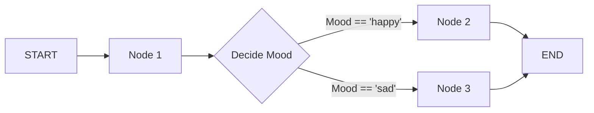

# Bloques de Construcción de LangGraph

Para construir aplicaciones con LangGraph, necesitas entender sus componentes principales. Exploremos los bloques fundamentales que conforman una aplicación LangGraph.

## Bloques de Construcción

Una aplicación en LangGraph comienza desde un punto de entrada, y dependiendo de la ejecución, el flujo puede ir a una función u otra hasta que alcance el END.




## 1. Estado (State)

El estado es el concepto central en LangGraph. Representa toda la información que fluye a través de tu aplicación.

```python
from typing_extensions import TypedDict

class State(TypedDict):
    graph_state: str
```

El estado es **definido por el usuario**, por lo que los campos deben ser cuidadosamente diseñados para contener toda la data necesaria para el proceso de toma de decisiones.

> 💡 **Consejo:** Piensa cuidadosamente qué información necesita rastrear tu aplicación entre pasos.

## 2. Nodos (Nodes)

Los nodos son **funciones de Python**. Cada nodo:

- Toma el estado como entrada
- Realiza alguna operación
- Retorna actualizaciones al estado

```python
def node_1(state):
    print("---Node 1---")
    return {"graph_state": state['graph_state'] + " Yo estoy"}

def node_2(state):
    print("---Node 2---")
    return {"graph_state": state['graph_state'] + " feliz!"}

def node_3(state):
    print("---Node 3---")
    return {"graph_state": state['graph_state'] + " triste!"}
```

Por ejemplo, los nodos pueden contener:

- **Llamadas a LLM**: Generar texto o tomar decisiones
- **Llamadas a herramientas**: Interactuar con sistemas externos
- **Lógica condicional**: Determinar los próximos pasos
- **Intervención humana**: Obtener input de usuarios

> 💡 **Info:** Algunos nodos necesarios para todo el flujo de trabajo como START y END existen directamente en LangGraph.

## 3. Aristas (Edges)

Las aristas conectan nodos y definen las rutas posibles a través de tu grafo:

```python
import random
from typing import Literal

def decide_mood(state) -> Literal["node_2", "node_3"]:

    # A menudo, usaremos el estado para decidir el próximo nodo a visitar
    user_input = state['graph_state']

    # Aquí, hagamos una división 50/50 entre los nodos 2 y 3
    if random.random() < 0.5:
        # 50% del tiempo, retornamos Node 2
        return "node_2"

    # 50% del tiempo, retornamos Node 3
    return "node_3"
```

Las aristas pueden ser:

- **Directas**: Siempre van del nodo A al nodo B
- **Condicionales**: Eligen el próximo nodo basado en el estado actual

## 4. StateGraph

El StateGraph es el contenedor que mantiene todo tu flujo de trabajo del agente:

```python
from IPython.display import Image, display
from langgraph.graph import StateGraph, START, END

# Construir grafo
builder = StateGraph(State)
builder.add_node("node_1", node_1)
builder.add_node("node_2", node_2)
builder.add_node("node_3", node_3)

# Lógica
builder.add_edge(START, "node_1")
builder.add_conditional_edges("node_1", decide_mood)
builder.add_edge("node_2", END)
builder.add_edge("node_3", END)

# Compilar
graph = builder.compile()
```

¡Que luego puede ser visualizado!

```python
# Visualizar
display(Image(graph.get_graph().draw_mermaid_png()))
```


Pero más importante aún, **ejecutado**:

```python
graph.invoke({"graph_state": "Hi, this is Lance."})
```

**Salida:**
```
---Node 1---
---Node 3---
{'graph_state': 'Hi, this is Lance. I am sad!'}
```

## Resumen

Los bloques de construcción de LangGraph proporcionan una estructura clara y poderosa para crear aplicaciones de IA complejas:

- **Estado**: El corazón de tu aplicación, transporta información entre nodos
- **Nodos**: Las funciones que procesan y transforman el estado
- **Aristas**: Las conexiones que definen el flujo entre nodos
- **StateGraph**: El contenedor que orquesta todo el proceso

Con estos componentes, puedes crear flujos de trabajo de agentes sofisticados con control preciso sobre cada paso del proceso.
