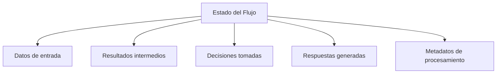
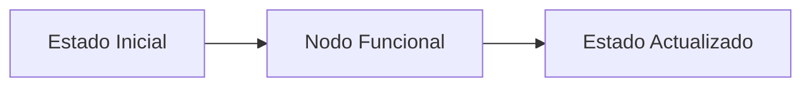
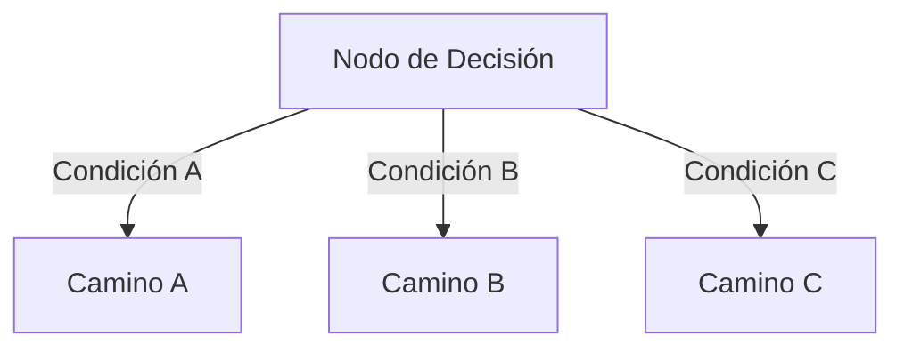
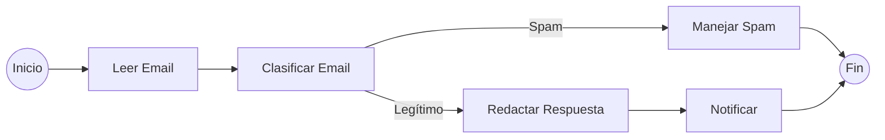
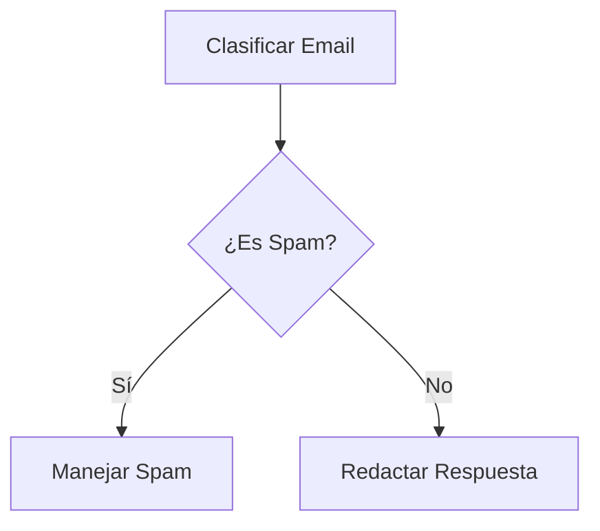
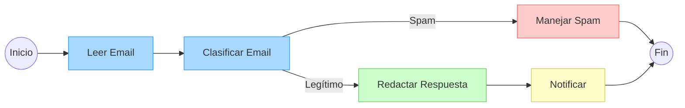
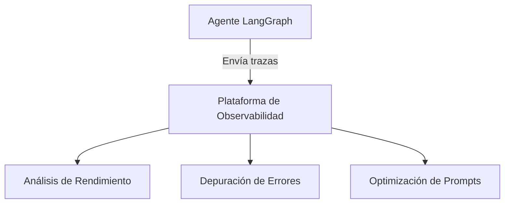

# Primeros Pasos con LangGraph

LangGraph es una biblioteca para construir aplicaciones basadas en flujos de trabajo con modelos de lenguaje. En este documento, aprenderás cómo crear tu primer agente utilizando LangGraph de manera sencilla y clara.

## ¿Qué es LangGraph?

LangGraph es un framework que permite orquestar flujos de trabajo complejos con modelos de lenguaje. Proporciona una estructura para definir estados, nodos funcionales y conexiones entre ellos, facilitando la creación de aplicaciones que requieren decisiones basadas en LLMs.

## Conceptos Fundamentales

### 1. Estado (State)

El estado es un diccionario tipado que almacena toda la información necesaria durante la ejecución del flujo de trabajo:



### 2. Nodos (Nodes)

Los nodos son funciones que procesan el estado actual y devuelven actualizaciones a ese estado:



### 3. Enrutamiento (Routing)

El enrutamiento determina qué camino seguir basado en el estado actual:



### 4. Grafo (Graph)

El grafo conecta todos los nodos y define el flujo completo de la aplicación.

## Ejemplo Práctico: Sistema de Procesamiento de Emails

Vamos a construir un sistema que procesa emails, los clasifica y genera respuestas preliminares.

### Flujo de Trabajo



### Paso 1: Definir el Estado

Necesitamos rastrear:
- El email que se está procesando
- La categoría del email
- Si es spam y por qué
- El borrador de respuesta
- Los mensajes intercambiados con el LLM

### Paso 2: Definir los Nodos Funcionales

1. **Leer Email**: Recibe y procesa la información básica del email.
2. **Clasificar Email**: Usa un LLM para determinar si el email es spam o legítimo.
3. **Manejar Spam**: Procesa los emails clasificados como spam.
4. **Redactar Respuesta**: Genera una respuesta preliminar para emails legítimos.
5. **Notificar**: Presenta la información procesada al usuario.

### Paso 3: Definir la Lógica de Enrutamiento

Necesitamos una función que determine qué camino seguir después de la clasificación:



### Paso 4: Crear el Grafo y Definir las Conexiones

1. Crear un StateGraph con nuestro tipo de estado.
2. Añadir todos los nodos.
3. Definir las conexiones directas.
4. Definir las conexiones condicionales.
5. Compilar el grafo.

## Consejos Prácticos

### Diseño del Estado
- Incluye toda la información necesaria para el procesamiento.
- Evita sobrecargar el estado con detalles innecesarios.
- Usa tipos opcionales para valores que pueden no existir en ciertos puntos.

### Implementación de Nodos
- Cada nodo debe tener una responsabilidad clara.
- Los nodos deben devolver solo las actualizaciones al estado, no el estado completo.
- Utiliza impresiones (print) para depurar el flujo durante el desarrollo.

### Enrutamiento
- Las funciones de enrutamiento deben ser claras y deterministas.
- Los valores devueltos deben coincidir exactamente con las claves en el mapeo de bordes condicionales.

## Visualización del Grafo

LangGraph permite visualizar el flujo de trabajo para facilitar su comprensión:



## Observabilidad y Monitoreo

Para aplicaciones en producción, es fundamental integrar herramientas de observabilidad como Langfuse:



## Conclusiones

LangGraph proporciona un marco estructurado para construir aplicaciones basadas en LLMs con flujos de trabajo claros. Sus principales ventajas son:

1. **Gestión de Estado**: Define claramente qué información se rastrea durante el proceso.
2. **Nodos Funcionales**: Implementa funcionalidades específicas que interactúan con LLMs.
3. **Enrutamiento Condicional**: Permite tomar diferentes caminos según el análisis del LLM.
4. **Estados Terminales**: Define claramente cuándo se completa un flujo de trabajo.

Con LangGraph, puedes construir aplicaciones que combinan la potencia de los LLMs con una estructura clara y mantenible.

## Inspeccionar Nuestro Agente de Clasificación de Correos con Langfuse 📡

Los agentes, por naturaleza, son impredecibles y difíciles de inspeccionar. Pero como el objetivo es construir un Agente y desplegarlo en producción, necesita trazabilidad robusta para el monitoreo y análisis futuros.

Para hacer esto, se puede usar una herramienta de observabilidad como Langfuse para rastrear y monitorear el agente.

### Instalación de Dependencias

Primero, instalamos Langfuse:

```bash
%pip install -q langfuse
```

Segundo, instalamos Langchain (LangChain es requerido porque usamos LangFuse):

```bash
%pip install langchain
```

### Configuración de Langfuse

A continuación, agregamos las claves API de Langfuse y la dirección del host como variables de entorno. Puedes obtener tus credenciales de Langfuse registrándote en Langfuse Cloud o auto-alojando Langfuse.

```python
import os

# Obtén las claves para tu proyecto desde la página de configuración del proyecto: https://cloud.langfuse.com
os.environ["LANGFUSE_PUBLIC_KEY"] = "pk-lf-..."
os.environ["LANGFUSE_SECRET_KEY"] = "sk-lf-..."
os.environ["LANGFUSE_HOST"] = "https://cloud.langfuse.com" # 🇪🇺 Región EU
# os.environ["LANGFUSE_HOST"] = "https://us.cloud.langfuse.com" # 🇺🇸 Región US
```

### Instrumentación del Agente

Luego, configuramos el callback_handler de Langfuse e instrumentamos el agente agregando el langfuse_callback a la invocación del grafo: `config={"callbacks": [langfuse_handler]}`.

```python
from langfuse.callback import CallbackHandler

# Inicializar CallbackHandler de Langfuse para LangGraph/Langchain (trazabilidad)
langfuse_handler = CallbackHandler()

# Procesar correo legítimo
legitimate_result = compiled_graph.invoke(
    input={"email": legitimate_email, "is_spam": None, "spam_reason": None, "email_category": None, "draft_response": None, "messages": []},
    config={"callbacks": [langfuse_handler]}
)
```

Con esta configuración, el desarrollador del Agente puede ahora rastrear todas las ejecuciones, analizar su comportamiento y depurar problemas de manera más eficiente desde el panel de control de Langfuse.
