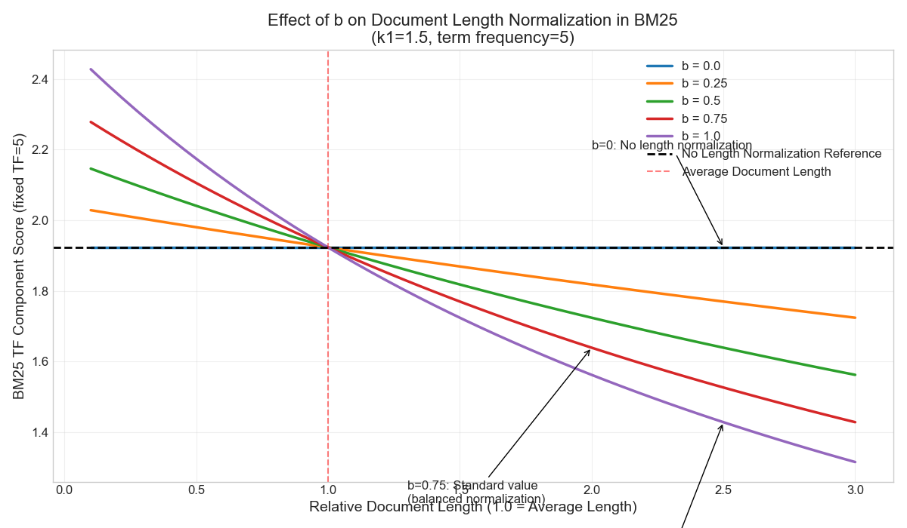

# Retrieval Augmented Generation (RAG) Examples

This repository contains examples and explanations for implementing Retrieval Augmented Generation (RAG) systems using different retrieval methods.

## Contents

- [Party Planning Agent](agent_3_rag.py): A simple RAG system using BM25 retrieval
- [BM25 vs TF-IDF Comparison](compare_bm25_tfidf.py): Implementation and comparison of both retrieval methods
- [BM25 Parameter Visualization](auxiliary_code/charts/bm25_parameter_plots.py): Interactive visualizations of BM25 parameters

## Understanding BM25 and TF-IDF

This section explains the key differences between BM25 and TF-IDF and how BM25's parameters affect retrieval performance.

### BM25 vs TF-IDF

Both BM25 and TF-IDF are lexical retrieval algorithms that match documents based on word occurrences, but BM25 offers significant improvements:

1. **Term Frequency Saturation**: While TF-IDF considers term frequency linearly, BM25 implements diminishing returns to prevent over-emphasizing repeated terms.

2. **Document Length Normalization**: BM25 properly accounts for document length, preventing longer documents from automatically ranking higher just because they contain more words.

3. **Probabilistic Foundation**: BM25 is derived from a probabilistic relevance framework, giving it stronger theoretical foundations than TF-IDF.

### Understanding BM25 Parameters

BM25 has two key parameters that control its behavior:


#### The k₁ Parameter: Term Frequency Saturation

The k₁ parameter controls how quickly the contribution of repeated terms saturates. It answers the question: "How much should we value seeing a term multiple times?"

The BM25 formula:

$$\text{TF}_{\text{BM25}} = \frac{(k_1 + 1) \cdot \text{tf}}{k_1 \cdot (1 - b + b \cdot \frac{\text{docLen}}{\text{avgDocLen}}) + \text{tf}}$$

- With **k₁ = 0**: After a term appears once, additional occurrences add nothing to the score.
- With **k₁ = 1.2-2.0** (standard range): Additional occurrences continue to matter but with diminishing returns.
- With **k₁ > 3.0**: Each additional occurrence adds significant value, closer to TF-IDF's linear behavior.



#### The b Parameter: Document Length Normalization

The b parameter controls how much document length affects scoring. It answers the question: "Should a term appearing in a short document count more than the same term appearing in a long document?"

- With **b = 0**: Document length has no effect on scoring.
- With **b = 0.75** (standard value): Moderate length normalization.
- With **b = 1**: Full document length normalization, where score is directly proportional to term density.


#### Parameter Recommendations for Different Use Cases

1. **General web search**: k₁ = 1.2-2.0, b = 0.75
2. **Technical documentation**: k₁ = 2.0-3.0, b = 0.5
3. **Short text collections** (tweets, headlines): k₁ = 1.2, b = 0.25-0.5
4. **Academic paper search**: k₁ = 1.5, b = 0.9

For a more detailed explanation with visualizations, see the [full BM25 parameter guide](auxiliary_code/charts/explanation_consolidated.md).

## Implementation Notes

The implementations in this repository demonstrate:

1. How to implement BM25 retrieval using LangChain's BM25Retriever
2. How to integrate retrieval with LLMs for RAG systems
3. How to set up custom retrieval tools for agents

## Limitations of Lexical Retrieval

It's important to note that both BM25 and TF-IDF are lexical retrieval methods, meaning:

- They match exact words, not meanings
- They don't understand synonyms or paraphrasing
- They don't work well across different languages

For semantic understanding or cross-language applications, embedding-based approaches (vector similarity) are recommended instead.

## Running the Examples

```python
# Example of running the party planning agent
from agent_3_rag import agent

response = agent.run("Find ideas for a luxury superhero-themed party.")
print(response)

# Example of running the BM25 vs TF-IDF comparison
from compare_bm25_tfidf import run_comparison

run_comparison("fox dog")
```

## Further Reading

For more information on BM25 and TF-IDF, see:
- [Robertson and Zaragoza, "The Probabilistic Relevance Framework: BM25 and Beyond"](https://www.staff.city.ac.uk/~sb317/papers/foundations_bm25_review.pdf)
- [Manning, Raghavan, and Schütze, "Introduction to Information Retrieval"](https://nlp.stanford.edu/IR-book/)
