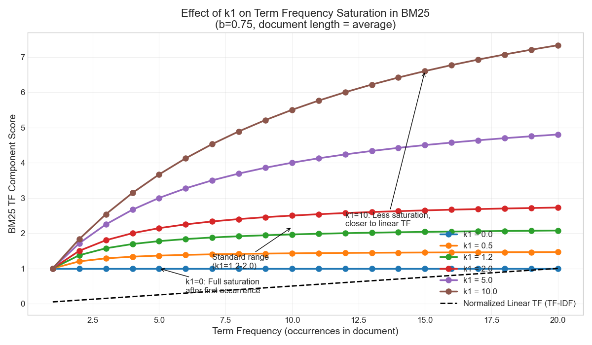
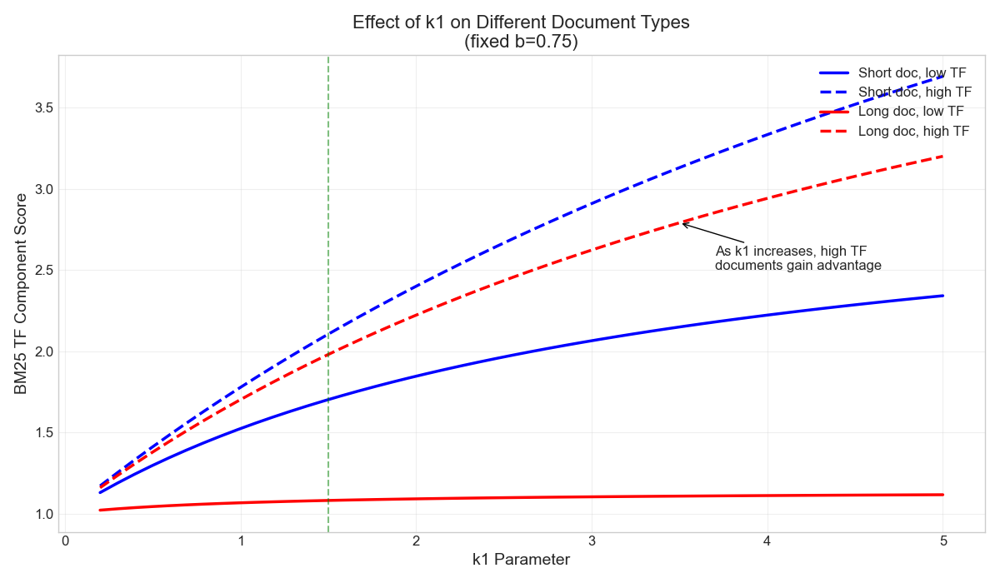
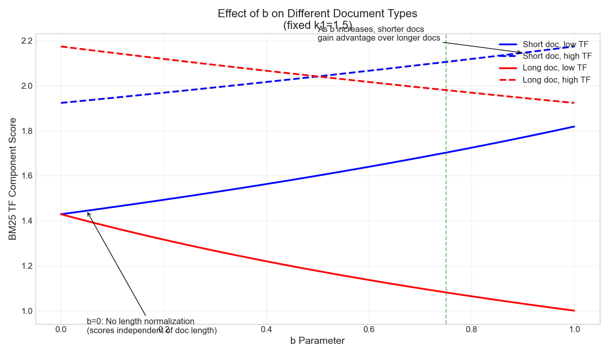
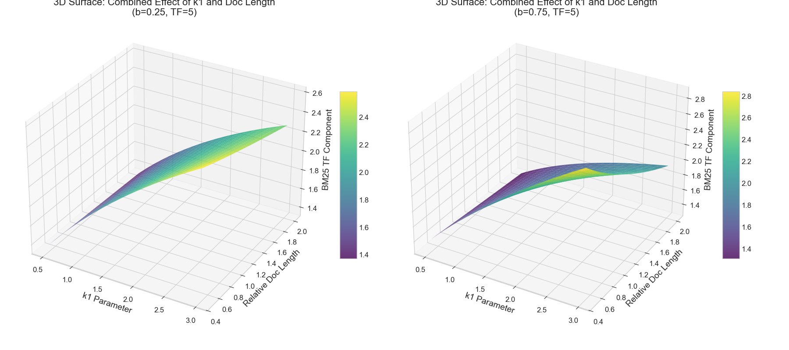
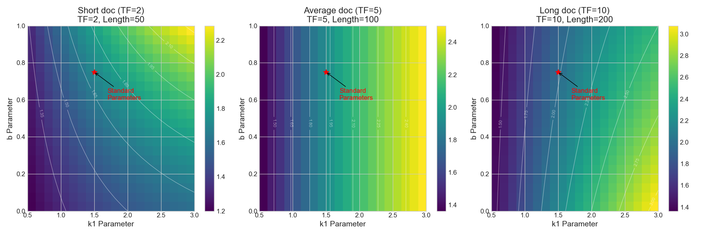

# Understanding BM25 Parameters: A Visual Guide

## Introduction

BM25 is a powerful text retrieval algorithm that improves upon the simpler TF-IDF by introducing two key parameters: $k_1$ and $b$. These parameters give BM25 remarkable flexibility, allowing it to adapt to different document collections and search needs. Let's explore how these parameters work through a mathematical and visual lens.

## The BM25 Formula

The core BM25 term frequency component is given by:

$$\text{TF}_{\text{BM25}} = \frac{(k_1 + 1) \cdot \text{tf}}{k_1 \cdot (1 - b + b \cdot \frac{\text{docLen}}{\text{avgDocLen}}) + \text{tf}}$$

Where:
- $\text{tf}$ is the term frequency (occurrences of the term in the document)
- $\text{docLen}$ is the length of the document
- $\text{avgDocLen}$ is the average document length in the collection
- $k_1$ and $b$ are the tunable parameters we'll explore

## The $k_1$ Parameter: Term Frequency Saturation

The $k_1$ parameter controls how quickly the contribution of repeated terms saturates. Think of it as answering the question: "How much should we value seeing a term multiple times?"

### Mathematical Effect

When we fix all other variables and only vary $k_1$, the term frequency component behaves as follows:

For very small $k_1$ values (approaching 0):
$$\lim_{k_1 \to 0} \text{TF}_{\text{BM25}} = \frac{\text{tf}}{\text{tf}} = 1 \text{ (for tf > 0)}$$

This means that as long as the term appears at all, its contribution is fixed at 1, regardless of how many times it appears.

For very large $k_1$ values:
$$\lim_{k_1 \to \infty} \text{TF}_{\text{BM25}} = \frac{\text{tf}}{k_1} \cdot \frac{k_1 + 1}{1} \approx \text{tf}$$

This approaches linear growth with term frequency, similar to traditional TF-IDF.

### Visual Interpretation

The graph above shows how different $k_1$ values create different response curves when a term appears multiple times:

- With $k_1 = 0$: The curve is essentially a step function that jumps from 0 to 1 as soon as the term appears once, then stays flat.
- With $k_1 = 1.2$ (standard): The curve rises quickly at first but begins to level off as term frequency increases.
- With $k_1 = 5$: The curve rises more steadily, approaching the linear relationship of TF-IDF.

When $k_1$ is small:
- The formula saturates quickly
- Additional occurrences of a term add little to the score after the first few
- Effectively says "I care that the term is present, but don't care much how many times"

When $k_1$ is large:
- The formula saturates slowly
- Each additional occurrence continues to add significant value
- Approaches a linear relationship like in basic TF-IDF
- Effectively says "More occurrences = more relevant, with minimal diminishing returns"

### Typical Values for $k_1$

- $k_1 = 0$: Complete saturation (binary relevance - term is either present or not)
- $k_1 = 1.2-2.0$: Standard range for most search applications
- $k_1 > 3.0$: Minimal saturation (closer to linear TF-IDF behavior)

### Real-World Analogy

Consider reading a news article about climate change:
- If "climate change" is mentioned once, the article is relevant.
- If it's mentioned 5 times, it's more likely to be focused on climate change.
- If it's mentioned 50 times in a short article, you don't consider it 50 times more relevant than an article mentioning it 5 times in a balanced way.

The $k_1$ parameter helps model this intuitive understanding of diminishing returns.

## The $b$ Parameter: Document Length Normalization

The $b$ parameter controls how much we should account for document length. It answers the question: "Should a term appearing in a short document count more than the same term appearing in a long document?"

### Mathematical Effect

Looking at the formula again and focusing on the $b$ parameter:

$$\text{TF}_{\text{BM25}} = \frac{(k_1 + 1) \cdot \text{tf}}{k_1 \cdot (1 - b + b \cdot \frac{\text{docLen}}{\text{avgDocLen}}) + \text{tf}}$$

When $b = 0$:
$$\text{TF}_{\text{BM25}} = \frac{(k_1 + 1) \cdot \text{tf}}{k_1 + \text{tf}}$$

The document length has no effect on scoring.

When $b = 1$:
$$\text{TF}_{\text{BM25}} = \frac{(k_1 + 1) \cdot \text{tf}}{k_1 \cdot \frac{\text{docLen}}{\text{avgDocLen}} + \text{tf}}$$

The term frequency is fully normalized by document length.

### Visual Interpretation

The graph above shows how different $b$ values affect scoring based on document length:

- With $b = 0$: The line is flat—document length has no effect.
- With $b = 0.75$ (standard): The curve gradually decreases as document length increases.
- With $b = 1$: The curve decreases more rapidly as document length increases.

The $b$ parameter adjusts how much the document length ratio (docLen/avgDocLen) affects the score:

When $b = 0$:
- Document length has no effect on scoring
- A term appearing once in a short document gets the same weight as appearing once in a long document
- Effectively says "I don't care about document length at all"

When $b = 1$:
- Full document length normalization
- Scores are fully adjusted based on the document's length compared to average
- Terms in shorter documents get higher weights
- Effectively says "I only care about term density, not absolute frequency"

### Typical Values for $b$

- $b = 0$: No length normalization
- $b = 0.75$: Standard value used in most search applications
- $b = 1$: Complete length normalization

### Real-World Analogy

Imagine comparing two book reviews:
- A concise 100-word review that mentions "brilliant plot" twice
- A detailed 1000-word review that mentions "brilliant plot" four times

With $b = 0$, the longer review would score higher (4 > 2).
With $b = 1$, the shorter review might score higher because its term density is higher (2/100 > 4/1000).
With $b = 0.75$, we get a balanced approach that partially, but not fully, accounts for the difference in length.

## How the Parameters Work Together

The real power of BM25 comes from the interplay between these parameters. Let's visualize some scenarios:

### Short Document with Few Term Occurrences

Consider a short article (half the average length) where our search term appears just once:

- With $k_1 = 1.2, b = 0$: The document gets a moderate score.
- With $k_1 = 1.2, b = 0.75$: The document gets a higher score because the length normalization boosts the importance of that single occurrence.
- With $k_1 = 1.2, b = 1$: The document gets an even higher score due to maximum length normalization.

### Long Document with Many Term Occurrences

Now imagine a long article (twice the average length) where our search term appears ten times:

- With $k_1 = 1.2, b = 0$: The document scores very high due to the multiple occurrences and no length penalty.
- With $k_1 = 1.2, b = 0.75$: The document scores moderately, as the length normalization partially offsets the higher term frequency.
- With $k_1 = 1.2, b = 1$: The document scores lower, as the full length normalization significantly reduces the value of each occurrence.

### Combined Parameter Effects

The 3D visualization shows how $k_1$ and document length interact for different $b$ values, while the heatmap shows optimal parameter regions for different document types.

## Practical Recommendations

Based on these dynamics, here are some recommended parameter settings for different scenarios:

1. **For varied-length collections**: Use $b$ closer to 0.75-1.0 to prevent long documents from dominating results

2. **For technical documentation**: Consider lower $b$ values (0.3-0.5) and higher $k_1$ values (2.0-3.0) to give more weight to term repetition, which can indicate importance in technical content

3. **For short-text collections** (tweets, headlines): $b$ near 0 (length doesn't matter much) and $k_1$ near 1.2 (some saturation but not much)

4. **For general web search**: The standard values ($k_1=1.2-2.0, b=0.75$) work well as they balance term frequency importance with reasonable length normalization

5. **For academic paper search**: $k_1 = 1.5, b = 0.9$ — Academic papers often have similar structures but varying lengths, so stronger length normalization helps compare them fairly.

## Conclusion

BM25's elegance lies in its mathematical balance and adjustability. By tuning just two parameters, we can dramatically change how retrieval works:

- $k_1$ controls the diminishing returns of repeated terms
- $b$ controls how much we account for document length

Together, they create a remarkably effective retrieval model that adapts to different document collections and search needs. This explains why, decades after its introduction, BM25 remains the default ranking function in many search systems—its simple yet powerful parameterization captures the nuances of human relevance judgment better than simpler alternatives like TF-IDF.

Understanding these parameters gives you deeper insight into information retrieval and allows you to fine-tune search systems for optimal performance across different domains and document types.

The visualizations here help develop an intuitive understanding of how these parameters shape the BM25 scoring function, making it clear why BM25 is superior to the simpler TF-IDF approach for many information retrieval tasks.
